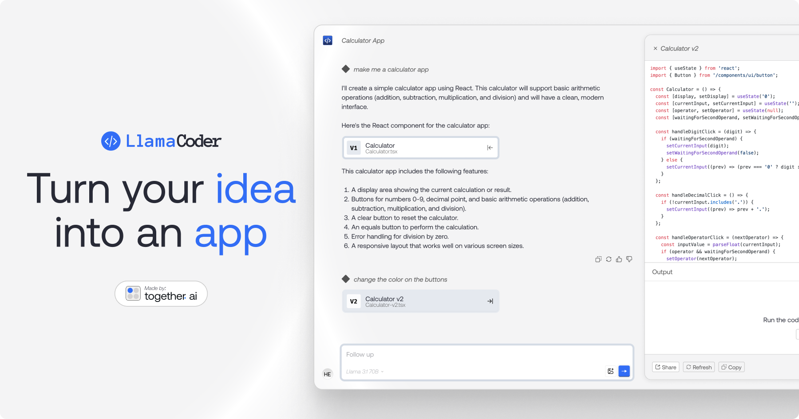

<a href="https://www.llamacoder.io">
  
  <h1 align="center">Llama Coder</h1>
</a>

<p align="center">
  An open source Claude Artifacts – generate small apps with one prompt. Powered by Llama 3 on Together.ai.
</p>

## Tech stack

- [Llama 3.1 405B](https://ai.meta.com/blog/meta-llama-3-1/) from Meta for the LLM
- [Together AI](https://togetherai.link/?utm_source=example-app&utm_medium=llamacoder&utm_campaign=llamacoder-app-signup) for LLM inference
- [Sandpack](https://sandpack.codesandbox.io/) for the code sandbox
- Next.js app router with Tailwind
- Helicone for observability
- Plausible for website analytics

## Cloning & running

1. Clone the repo: `git clone https://github.com/Nutlope/llamacoder`
2. Create a `.env` file and add your [Together AI API key](https://togetherai.link/?utm_source=example-app&utm_medium=llamacoder&utm_campaign=llamacoder-app-signup): `TOGETHER_API_KEY=`
3. Run `npm install` and `npm run dev` to install dependencies and run locally

## Docker

### Building the Docker image

1. Clone the repo: `git clone https://github.com/Nutlope/llamacoder`
2. Navigate to the project directory: `cd llamacoder`
3. Build the Docker image: `docker build -t llamacoder-app .`

### Running the Docker container

1. Create a `.env` file and add your environment variables:
   ```
   TOGETHER_API_KEY=your_together_api_key
   HELICONE_API_KEY=your_helicone_api_key
   DATABASE_URL=postgresql://<username>:<password>@db:5432/<database>
   POSTGRES_USER=your_postgres_user
   POSTGRES_PASSWORD=your_postgres_password
   POSTGRES_DB=your_postgres_db
   ```
2. Run the Docker container using `docker-compose`:
   ```
   docker-compose up
   ```

## Contributing

For contributing to the repo, please see the [contributing guide](./CONTRIBUTING.md)
